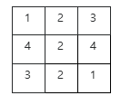
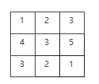

우주선 싸피2호는 화성에 착륙해 주변 사진을 찍어 전송하는 임무를 갖고 있으며, 착륙 지점을 중심으로 주변 8개 구역을 대상으로 착륙지점보다 높이가 낮은 구역의 사진을 찍을 수 있다. 싸피 1호가 측정한 높이 정보를 이용하면 최적의 착륙장소를 정할 수 있지만, 폭풍 등 극한상황을 대비한 예비후보지를 정하려 하는데, 예비 후보지는 8개의 방향 중 사진을 찍을 수 있는 방향이 4방향 이상인 지점으로 정하려고 한다. 싸피 1호가 측정한 높이 정보가 주어질 때, 예비 후보지의 수를 알아내는 프로그램을 만드시오. 주변에 높이 정보가 없는 영역이 포함되어 있어도, 알려진 영역의 높이만 조건을 만족하면 후보지에 포함된다.

다음과 같은 지형은 착륙지 높이(2)보다 낮은 지역이 2곳 밖에 없으므로 후보지가 될 수 없다.
 

 
다음의 경우 착륙지 높이(3)보다 낮은 지역이 총 4곳이므로 후보지에 포함한다.
 

 
입력

검토해야할 구역의 개수 T가 첫 줄에 주어진다. 다음 줄부터 첫 줄에 구역의 크기 N, M이 주어지고, 다음 줄부터 N줄에 걸쳐, M개 씩의 높이 정보 Aij가 제공된다.

3<=N, M<=100, 0<=Aij<10

출력

#과 1번부터 시작하는 구역번호, 빈칸에 이어 조건을 만족하는 예비 후보지의 개수를 출력한다.